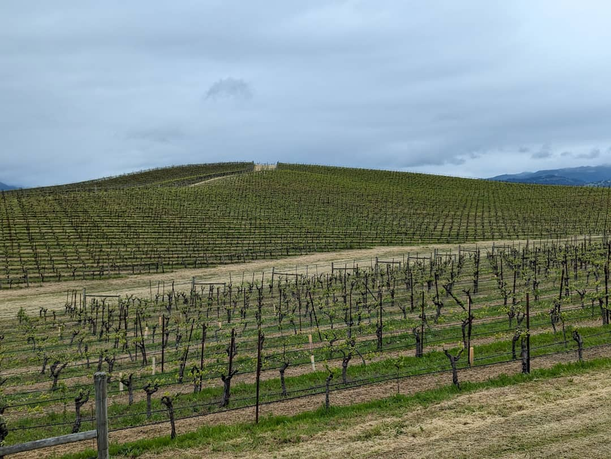
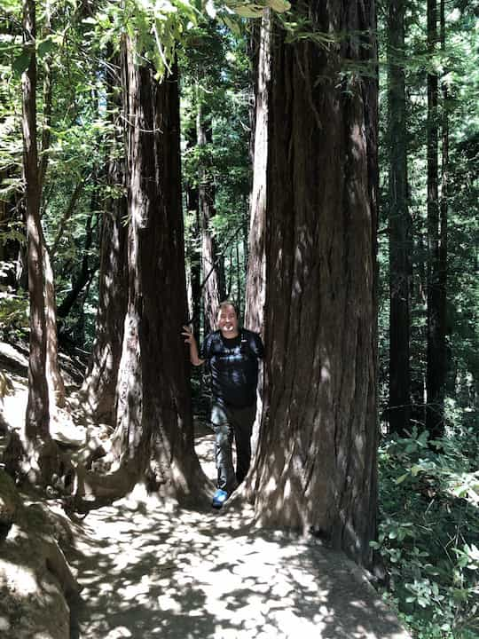
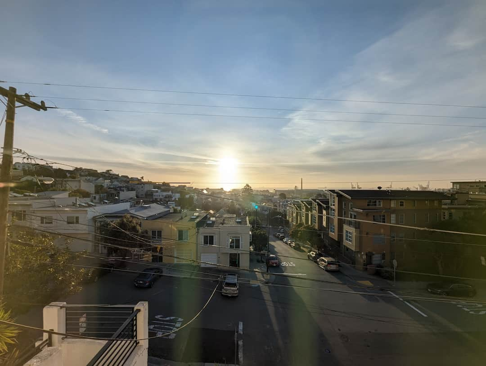
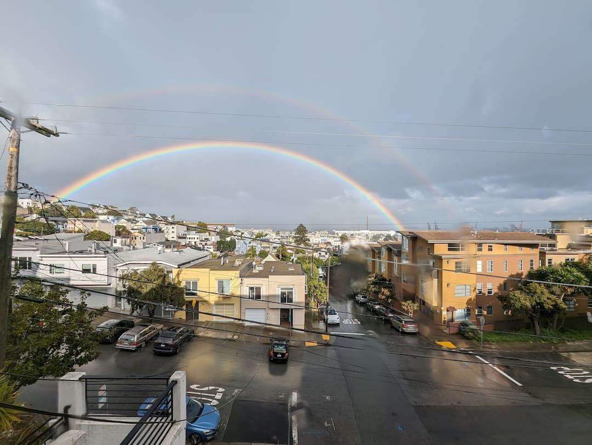

### Hi there 👋

I'm Andrew.  
  

I teach people with diverse backgrounds and diverse skill sets how to build full stack web apps at [Prime Digital Academy](https://www.primeacademy.io/).

I like talking about tech so much, I joined a club for talking.  They even made me president.  If you're free Thursdays at Noon Central, [join us](https://1767.toastmastersclubs.org/)!

I live in San Francisco.  
 

With my amazing wife and our adorable cat Simone.  
  

In my free time, I like to [tell stories](https://dnd.wizards.com/adventurers-league) with friends and strangers.

I like building things to help people:
- [Nicu Calc](https://www.nicucalc.org/)

I also like building things for fun:
- [Auth Is Cool](https://authis.cool/)

Sometimes I build things, just because I wonder if I can:
- 

  
Govee Light Control

  I'm not letting you control my lights!  This is a real project, but it requires a login.  If you're interested, check out the code in my pinned repos.

<!--
**aharasymiw/aharasymiw** is a ✨ _special_ ✨ repository because its `README.md` (this file) appears on your GitHub profile.

Here are some ideas to get you started:

- 🔭 I’m currently working on ...
- 🌱 I’m currently learning ...
- 👯 I’m looking to collaborate on ...
- 🤔 I’m looking for help with ...
- 💬 Ask me about ...
- 📫 How to reach me: ...
- 😄 Pronouns: ...
- ⚡ Fun fact: ...
-->
